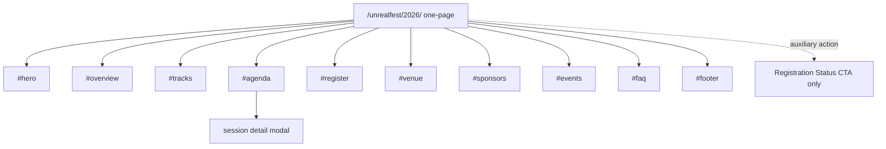

# Unreal Fest Seoul 2026 원페이지 사이트 구조안

## 프로젝트 기본 정보

| 항목 | 내용 |
| --- | --- |
| 프로젝트명 | 언리얼 페스트 서울 2026 공식 사이트 |
| 이벤트 일정 | 2026년 8월 20일(목) ~ 21일(금) |
| 장소 | 웨스틴 조선 서울 파르나스 |
| 형식 | 오프라인 중심 + 일부 세션 온라인 방송 |
| 주최 | 에픽게임즈 코리아 |
| 운영 | 에픽라운지 (주식회사 그리프) |

## 목표

Unreal Fest Seoul 2026 사이트는 `멀티페이지 마이크로사이트`가 아니라 `프리미엄 원페이지 행사 랜딩`으로 설계한다.

핵심 원칙은 아래와 같다.

- 메인 결과물은 하나의 긴 스크롤 페이지여야 한다.
- 상단 내비게이션은 모두 페이지 이동이 아니라 섹션 앵커 이동이어야 한다.
- 세션 상세만 예외적으로 `modal / overlay` 경험으로 보여준다.
- `Register`는 원페이지 안의 섹션과 CTA로 해결한다.
- `Registration Status`는 메인 랜딩의 별도 페이지 시안으로 만들지 말고, 헤더 CTA 또는 보조 액션으로만 표현한다.

## 왜 원페이지인가

이번 사이트의 주 목적은 사용자가 짧은 시간 안에 아래를 이해하고 행동하게 만드는 것이다.

1. 행사 개요를 빠르게 이해한다.
2. 주요 세션과 트랙을 둘러본다.
3. 등록 여부를 판단하고 바로 등록한다.
4. 필요한 경우 FAQ와 장소 정보를 확인한다.

따라서 정보구조는 `페이지 분리`보다 `한 화면에서 빠른 이해와 이동`에 최적화되어야 한다.

## 권장 구조 원칙

- 구조는 원페이지
- UX는 앵커 기반 내비게이션
- 상세 정보는 세션 모달로 처리
- CTA는 상단과 중간, 하단에 반복 배치
- 레이아웃은 콘텐츠 허브형, 포스터형이 아님
- Hero는 강렬하되 정보가 비어 있으면 안 됨

## 개선된 사이트맵

```text
/unrealfest/2026/                         One-page landing
├── #hero                                 행사 핵심 메시지
├── #overview                             행사 소개 / 일정 / 장소 / 형식
├── #tracks                               주요 트랙 소개
├── #agenda                               아젠다 섹션
│   └── session detail modal              세션 상세 모달
├── #register                             등록 안내 / CTA
├── #venue                                장소 / 체크인 / 오시는 길
├── #sponsors                             스폰서
├── #events                               부대 이벤트
├── #faq                                  자주 묻는 질문
└── #footer                               하단 정보

Utility action only
└── Registration Status CTA               보조 액션, 별도 메인 시안 범위 아님
```

### Mermaid 구조도



## 내비게이션 규칙

### Header

- Overview
- Tracks
- Agenda
- Venue
- Sponsors
- FAQ

우측 CTA:

- Register
- Registration Status

설명:

- `Overview`, `Tracks`, `Agenda`, `Venue`, `Sponsors`, `FAQ`는 모두 같은 페이지 안의 앵커 링크다.
- `Registration Status`는 메인 사이트 디자인의 별도 페이지가 아니라 작은 유틸리티 액션으로만 표현한다.

### Mobile Menu

- Overview
- Tracks
- Agenda
- Register
- Venue
- FAQ

## 페이지가 아니라 섹션으로 설계해야 하는 이유

아래 항목들은 독립 페이지가 아니라 원페이지 내부 섹션으로 설계한다.

- Overview
- Tracks
- Agenda
- Register
- Venue
- Sponsors
- Events
- FAQ

아래 항목만 모달 또는 유틸리티로 처리한다.

- Session Detail: 모달
- Registration Status: 보조 CTA

## 섹션별 역할

### 1. Hero

반드시 포함:

- 행사명
- 핵심 메시지
- 날짜
- 장소
- Primary CTA: Register
- Secondary CTA: Agenda 보기

표현해야 하는 고정 정보:

- 언리얼 페스트 서울 2026
- 2026년 8월 20일(목) ~ 21일(금)
- 웨스틴 조선 서울 파르나스
- 오프라인 중심 + 일부 세션 온라인 방송
- 주최: 에픽게임즈 코리아
- 운영: 에픽라운지 (주식회사 그리프)

### 2. Overview

이 섹션은 행사 전체를 빠르게 이해시키는 정보 허브다.

- 행사 소개
- 일정
- 장소
- 운영 방식
- 대상 관객
- 왜 참석해야 하는지

### 3. Tracks

행사의 큰 카테고리를 요약한다.

- 게임
- 미디어 & 엔터테인먼트
- 산업 / 시뮬레이션

각 트랙은 짧은 설명과 대표 세션 카드로 연결한다.

### 4. Agenda

가장 중요한 섹션이다.

반드시 포함:

- Day 1 / Day 2 tabs
- Track filters
- Level filters
- 선택 사항: Format filters
- summary bar
- card + timetable hybrid layout

세션 카드는 최소 아래 정보를 보여야 한다.

- 시간
- 제목
- 발표자
- 트랙
- 난이도
- `상세보기` 액션

`상세보기`를 누르면 별도 페이지가 아니라 `session detail modal`이 떠야 한다.

### 5. Session Detail Modal

이 사이트에서 유일하게 강조된 상세 레이어다.

모달에 포함할 정보:

- 세션 제목
- 날짜 / 시간
- 트랙
- 난이도
- 발표자 정보
- 세션 소개
- 세션 목차
- 권장 대상
- 캘린더 추가
- Register CTA

원칙:

- 독립 페이지처럼 풍부해야 하지만 실제 구조는 모달이어야 한다.
- 배경 페이지는 유지하고 포커스만 세션에 집중시킨다.

### 6. Register

등록은 별도 페이지가 아니라 메인 원페이지 안의 강한 CTA 섹션으로 처리한다.

- 티켓 안내
- 참가 방식 안내
- 정책 요약
- 등록 CTA
- Registration Status 링크

### 7. Venue

- 장소
- 체크인 안내
- 오시는 길
- 교통 / 주차 관련 정보

### 8. Sponsors

- 메인 스폰서 로고
- 파트너 로고
- 필요 시 짧은 설명

### 9. Events

- 커뮤니티 이벤트
- 체험 부스
- 네트워킹 요소

### 10. FAQ

accordion 구조 권장

카테고리 예시:

- 등록 / 결제
- 입장 / 체크인
- 온라인 시청
- 세션 / 언어 / 통역
- 환불 / 취소
- 참가 확인증

## Figma Make용 명시 규칙

이 문서를 사용하는 경우 아래를 반드시 명시해야 한다.

- separate pages를 만들지 말 것
- 결과물은 `하나의 one-page landing`이어야 할 것
- session detail만 modal로 보여줄 것
- `Register`, `Venue`, `FAQ`는 페이지가 아니라 섹션일 것
- `Registration Status`는 별도 메인 화면을 만들지 말 것

## 출력 범위

필수:

- Desktop 1440 기준 one-page main screen
- Desktop session detail modal state
- Mobile 390 기준 one-page main screen

선택:

- Mobile session detail modal state

불필요:

- Home / Agenda / Register / Venue / FAQ를 별도 페이지로 쪼갠 다중 화면 세트

## 최종 방향

이번 시안의 정답은 `정보가 많은 멀티페이지 행사 사이트`가 아니라, `한 화면에서 빠르게 이해하고 바로 행동하게 만드는 프리미엄 원페이지 이벤트 경험`이다.

따라서 구조는 아래 한 줄로 요약된다.

`One-page landing + session detail modal + registration utility CTA`
